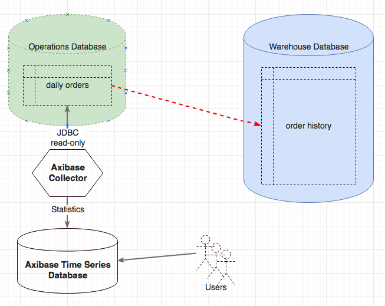
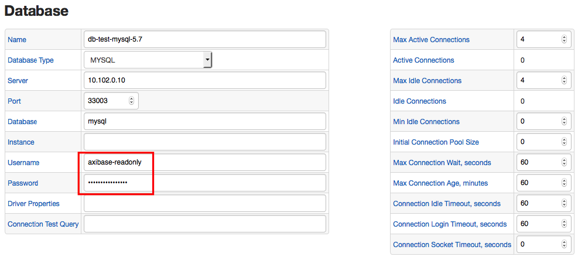
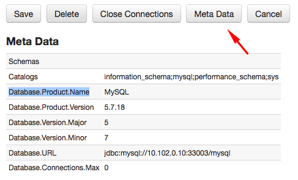
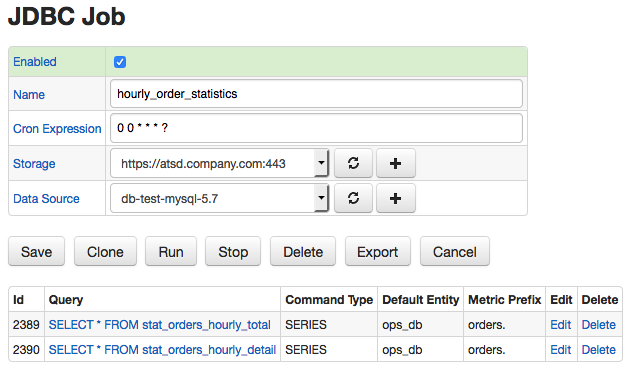
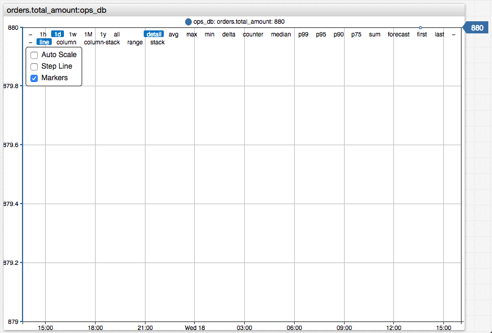

# Historizing Metrics Stored in Database

## Overview

The following article describes the process of calculating and historizing operational metrics stored in a relational database.

## Scenario

Consider a scenario where we have a relational database where one of the tables contains a list of customer orders. The number of daily records is very high and for performance reasons the records from this table are moved to a warehouse database as part of the pruning procedure. Lets assume now that the operations analysts would like to monitor incoming orders to spot deviations from a baseline as quickly as possible. The hourly baseline is calculated by averaging the number of orders received from customers during the same hour on the same weekday 1, 2, and 4 weeks ago.

Since the intraday records and historical records are stored in different databases it's not possible to run a single query that would return the number of orders spanning several weeks. Moreover, the query against the warehouse table maybe too expensive to run on a continuous basis. In addition, if the operations table were to be queried by multiple monitoring tools this may introduce an overhead that the operations team is not willing to introduce.

## Solution

This challenge can be addressed by scheduling execution of an analytical query (the one that calculates aggregate statistics) and persisting its results in a separate table. Operational databases are often locked down to serve only primary applications and storing hourly order statistics in the same database may not be advisable or allowed. For added protection, it is recommended that the analytical query is executed under a read-only user account with a permission to SELECT data from a specific view encapsulating the query business logic.

The steps below describe how this type of monitoring can be enabled in Axibase Time Series Database.



---

### Analyze Raw Data

It's important to understand the available data in order to determine useful statistics for the end users (operations analysts in our case). For the purpose of this guide, lets assume that incoming orders are stored in the `daily_orders` table.

```sql
CREATE TABLE daily_orders
  (customer VARCHAR(64), amount DECIMAL(9,2), received timestamp DEFAULT CURRENT_TIMESTAMP)
```

The records are continuously added to the table as customers place new orders.

```sql
INSERT INTO daily_orders (customer, amount) VALUES ('Pizza 101', 90.00)
...
INSERT INTO daily_orders (customer, amount) VALUES ('TravelGuru', 430.00)
...
INSERT INTO daily_orders (customer, amount) VALUES ('eBank', 920.00)
```

The `daily_orders` table contains all orders received during the current business day.

```sql
SELECT * FROM daily_orders
```

```ls
| customer    | amount | received             |
|-------------|--------|----------------------|
| Pizza 101   | 90     | 2018-04-18T03:02:00Z |
| TravelGuru  | 430    | 2018-04-18T08:06:21Z |
| eBank       | 920    | 2018-04-18T09:16:25Z |
```

The orders received during the last hour can be selected by adding a time condition.

```sql
SELECT * FROM daily_orders
  WHERE received > NOW() - INTERVAL 1 HOUR
```

---

### Calculate Statistics with Analytical Queries

The operations analysts are not interested in the specific orders, instead they need to know the total number and the dollar amount of orders received during the last hour.

```sql
SELECT SUM(amount), COUNT(amount)
  FROM daily_orders
WHERE received > NOW() - INTERVAL 1 HOUR
```

```ls
| SUM(amount) | COUNT(amount) |
|-------------|---------------|
| 920         | 1             |
```

In addition, they might be interested in tracking the top customers during the given hour and therefore another query grouping orders by customer is necessary.

```sql
SELECT customer, SUM(amount), COUNT(amount)
  FROM daily_orders
WHERE received > NOW() - INTERVAL 1 HOUR
  GROUP BY customer
```

```ls
| customer | SUM(amount) | COUNT(amount) |
|----------|-------------|---------------|
| eBank    | 920         | 1             |
```

### Preparing Queries for Historical Retention

To differentiate collected metrics by name, we need to assign aliases to each column.

For the summary statistics (without `GROUP BY` customer clause) we will adopt the `total_` prefix.

```sql
SELECT SUM(amount) AS total_amount, COUNT(amount) AS total_count
  FROM daily_orders
WHERE received > NOW() - INTERVAL 1 HOUR
```

For the detailed statistics (grouped by customer) we will adopt the `customer_` prefix and will add the customer name to the list of column in the `SELECT` expression.

```sql
SELECT customer, SUM(amount) AS customer_amount, COUNT(amount) AS customer_count
  FROM daily_orders
WHERE received > NOW() - INTERVAL 1 HOUR
  GROUP BY customer
```

## Creating Views and Granting Permissions

Creating views is an optional step and is recommended to prevent the monitoring account under which the queries will be executed from customizing the query text and thus inadvertently retrieving more data than necessary for monitoring purposes.

```sql
CREATE VIEW stat_orders_hourly_total AS
  SELECT sum(amount) AS total_amount, count(amount) AS total_count
    FROM daily_orders
  WHERE received > NOW() - INTERVAL 1 HOUR
```

```sql
CREATE VIEW stat_orders_hourly_detail AS
  SELECT customer, SUM(amount) AS customer_amount, COUNT(amount) AS customer_count
    FROM daily_orders
  WHERE received > NOW() - INTERVAL 1 HOUR
    GROUP BY customer
```

We can then create a read-only account and restrict it to executing `SELECT` queries on specific views.

```sql
GRANT SELECT ON mysql.stat_orders_hourly_total TO 'axibase-readonly'@'%';
```

```sql
GRANT SELECT ON mysql.stat_orders_hourly_detail TO 'axibase-readonly'@'%';
```

* `stat_orders_hourly_total` results

```ls
| total_amount | total_count |
|--------------|-------------|
| 920          | 1           |
```

* `stat_orders_hourly_detail` results

```ls
| customer | customer_amount | customer_count |
|----------|-----------------|----------------|
| eBank    | 920             | 1              |
```

## Scheduling Job in Axibase Collector

The [JDBC](https://github.com/axibase/axibase-collector/blob/master/jobs/jdbc.md) job in Axibase Collector allows you to execute any query against wide range of databases and persist its results in the Axibase Time Series Database for visualization, alerting, and forecasting.

### Create Data Source

To connect the Collector to a database, create a new data source connection on the **DataSources > Databases** page.



Click **Meta Data** to test the connection.



Execute a sample query to verify permissions.

Add `LIMIT n` clause to the test query in order to restrict the number of returned rows, just in case.

```sql
SELECT * FROM stat_orders_hourly_total LIMIT 5
```


### Create JDBC Job

Now that the data source is configured and validated, create a new `JDBC` job on the **Jobs** tab.


To execute the job once per hour, set schedule as `0 0 * * * ?`.

Each query requires a separate configuration in the `JDBC` job. The configurations within the same job are executed sequentially to help minimize the load on the database.

The configuration determines rules for mapping results of the query to ATSD schema.

The ATSD schema requires that each time series has an entity name, a metric name, time, value. Series tags are optional and are set for series with extra dimensions.

Both of the below queries will be storing data under the manually specified 'ops_db' value.

A common 'orders.' metric prefix is set so that these series can be distinguished from other similarly named metrics (avoid naming collision).

> The same result can be accomplished by modifying column aliases which is less convenient in case of `SELECT *` queries.

* Configuration for `stat_orders_hourly_total` view

This query doesn't have any text columns and as such doesn't require any series tags.

```ls
series e:ops_db d:2018-04-18T10:24:08.493Z m:orders.total_amount=920 m:orders.total_count=1
```


* Configuration for `stat_orders_hourly_detail` view

This query extracts customer name as an extra dimension which is captured with the `customer` tag in the configuration.

```ls
series e:ops_db d:2018-04-18T10:25:10.126Z t:customer=eBank m:orders.customer_amount=920 m:orders.customer_count=1
```


At the final stage, make sure that the job is enabled.



Click **Run** to execute the job manually for the first time.


## Locate Metrics in ATSD

The series collected by Collector can be located in ATSD in various ways: series search, metrics for entity, metrics by name, etc.

Open the **Metrics** tab and search metrics by name or prefix.


To view individual series, click on the **Series** icon and then on the chart link.




## Monitoring Data

Now that you have data being continuously inserted into ATSD, you can:

* Visualize data with [portals](https://github.com/axibase/atsd/blob/master/portals/README.md). Show hourly orders overlaid with previous day/week/etc.


* Build automated [forecasts](https://github.com/axibase/atsd/blob/master/forecasting/README.md).
* Create Slack/email [alerts](https://github.com/axibase/atsd/blob/master/rule-engine/web-notifications.md#collaboration-services) using the [rule engine](https://github.com/axibase/atsd/tree/master/rule-engine#rule-engine) to get notified when the order activity is abnormal.
